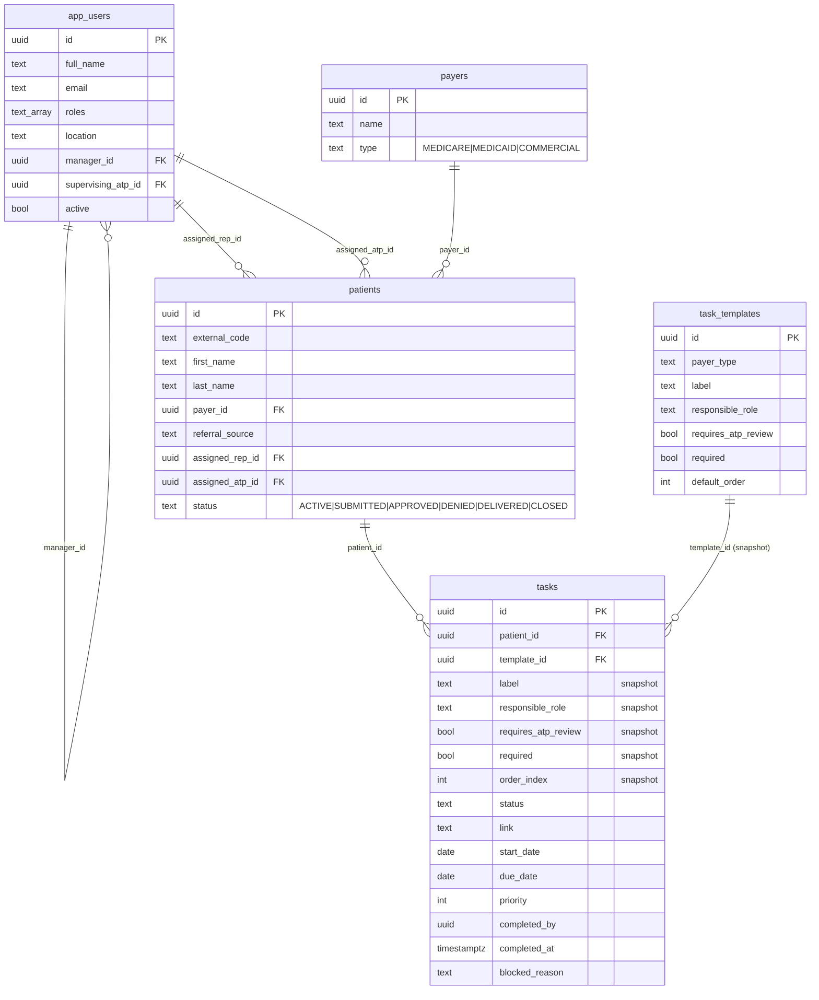

# Architecture — Choice Healthcare Patient Pipeline Tracker (v1)

## 1. Overview

Choice Healthcare is a small medical-equipment provider whose staff currently track each patient's prior-authorization pipeline in scattered spreadsheets and group chats. The tracker is an internal web app that gives every Rep, ATP, Manager, and the owner ("Boss") a single live view of where each patient is in the workflow, what task is next, who owns it, and which approvals are still outstanding. v1 is a thin-but-correct slice: auth, an RLS-protected data model, snapshotted per-patient task lists, and an ATP approval gate. It is not a document store, EHR, or e-sign tool.

## 2. Stack

- **Frontend**: Next.js 16.2 App Router, React 19.2, Tailwind 4 (via `@tailwindcss/postcss`).
- **Backend**: Supabase open-source stack — Postgres 17, GoTrue Auth, PostgREST, Kong, Row-Level Security. Currently using hosted Supabase for synthetic data while moving to self-hosted Supabase on AWS EC2.
- **Client libraries**: `@supabase/ssr` for cookie-based server/middleware/browser clients (`src/lib/supabase/{server,browser}.ts`).
- **Hosting**: AWS Amplify for the Next.js app, with Supabase self-hosted on AWS EC2.
- **Local Supabase config**: `supabase/config.toml` declares the Azure external provider and email auth on ports 54321/54322/54323.

## 3. For non-technical operators — AWS, Amplify, and EC2

This section is for people who use the tracker daily and have AWS console access but do not live in DevOps jargon.

### Two places, two jobs

| What you use | AWS product name | What it stores / runs | Updates when… |
|--------------|------------------|---------------------|---------------|
| The website in the browser | **Amplify** | The Next.js app (screens, buttons, logic) | You push code to GitHub (`main`); Amplify rebuilds automatically |
| Patients, tasks, logins, passwords | **EC2** (+ Docker Supabase on that server) | Postgres database + auth API | Someone runs **database migrations** on the server (not automatic with a git push) |

**EC2** (Elastic Compute Cloud) is simply Amazon’s name for a **rented computer in the cloud**. For Choice Healthcare, one EC2 machine hosts the **database**. The team often says “EC2” or “the server” when they mean that machine—not the Amplify website.

**Amplify** hosts the **app UI** only. It talks to the database over the network (via a secure proxy). Changing the app does not change the database schema unless migrations are applied on EC2.

### Choice Healthcare identifiers (production)

| Piece | Where to look |
|-------|----------------|
| Live app URL | `https://main.d2na0dxbmaa2o4.amplifyapp.com` |
| Database server IP | `44.253.198.43` (Elastic IP on the EC2 instance) |
| EC2 instance ID | `i-0c55b5678f0ec6cf7` |
| AWS region | **US West (Oregon)** — `us-west-2` |
| Amplify app ID | `d2na0dxbmaa2o4` |
| Supabase install path on the server | `/opt/choice-supabase` |

Operational detail (SSH, env vars, migration scripts): [`infra/aws/DEPLOYMENT.md`](infra/aws/DEPLOYMENT.md).

### How to find EC2 in the AWS Console

1. Sign in at [https://console.aws.amazon.com/](https://console.aws.amazon.com/) with the Choice Healthcare account (or the account your admin invited you to).
2. **Set the region** (top-right, near your username). Choose **US West (Oregon) / us-west-2**. EC2 resources are regional—wrong region shows an empty list.
3. Open **EC2**:
   - Use the search bar at the top, type **EC2**, click **EC2** under Services, or
   - Menu ☰ → **Compute** → **EC2**.
4. In the left sidebar, click **Instances** → **Instances**.
5. Find the tracker database server:
   - Look for instance ID **`i-0c55b5678f0ec6cf7`**, or
   - Look for **Public IPv4 address** **`44.253.198.43`**, or
   - Look for a name tag like `choice-supabase` if your team added one.

That row is “the EC2 box.” You do **not** need to start/stop it for normal app use. Stopping it would take the database offline for everyone.

Other useful EC2 sidebar items (read-only for most users):

- **Elastic IPs** — shows `44.253.198.43` attached to the instance (stable address).
- **Security groups** — firewall rules (usually left to whoever set up the server).

### How to find Amplify (the website hosting)

1. Same AWS login and region (**us-west-2** is typical for this project; Amplify apps are also region-scoped).
2. Search **Amplify** in the top bar → **AWS Amplify**.
3. Open the app **`d2na0dxbmaa2o4`** (or the app whose domain is `main.d2na0dxbmaa2o4.amplifyapp.com`).
4. Branch **main** → recent deploys show whether a git push finished building.

Redeploying or env vars for the app are done here—not in EC2.

### “I pushed code—why didn’t the database feature work?”

Example: **Sent for signature** needs a new task status in Postgres. The app code on Amplify may be up to date, but the database must allow status `AWAITING_SIGNATURE`. That requires migration **`0011_task_awaiting_signature_status.sql`** (and related migrations) on **EC2**, via the script in [`infra/aws/DEPLOYMENT.md`](infra/aws/DEPLOYMENT.md) § “Apply database migrations.”

Rule of thumb:

- **UI / button / label change** → git push → Amplify (minutes).
- **New column, new status, new table, RLS change** → migration on **EC2** (one-time per migration, needs SSH or someone who has it).

### If you have AWS access but SSH does not work

You do **not** need a `.pem` file or PuTTY if you use **EC2 Instance Connect** (terminal inside the AWS website):

1. EC2 → Instances → `i-0c55b5678f0ec6cf7` → **Connect** → **EC2 Instance Connect** → **Connect**.
2. Paste and run the one-liner from [`infra/aws/DEPLOYMENT.md`](infra/aws/DEPLOYMENT.md) § “Option A — Browser terminal”.

That downloads and applies migrations `0004`–`0011` (including **Awaiting signature**).

From Windows, you can also run `infra/aws/scripts/apply-migrations-from-windows.ps1`, which fixes many SSH issues (wrong IP on the firewall rule, key permissions) before giving up.

If both fail, use **CloudShell** in the AWS console (see [`infra/aws/DEPLOYMENT.md`](infra/aws/DEPLOYMENT.md) § “Option C — AWS CloudShell”). You may need a **temporary** SSH rule allowing **Anywhere** (`0.0.0.0/0`) on port 22 — **My IP** alone does not allow CloudShell or the browser connect proxy to reach the server.

## 4. Data model



In v1 a **patient row represents one active pursuit** — patient and "case" are merged so we don't pay the cost of a separate cases table for a workflow that almost always has exactly one in-flight pursuit at a time.

**Tasks are snapshotted from templates.** When a patient is created the matching `task_templates` rows for that payer type are copied into `tasks` (label, responsible_role, requires_atp_review, required, order_index are all denormalized). The `template_id` is kept as a soft pointer (`on delete set null`) but is not authoritative. This means a Manager can edit the master checklist later without rewriting history on patients already mid-flow.

Allowed enum values are enforced with `check` constraints rather than Postgres `ENUM` types — easier to edit in a migration.

## 5. Auth flow

1. User hits any protected path. `src/proxy.ts` checks for a Supabase session cookie via `supabase.auth.getUser()` and, if absent, 302s to `/login?next=<path>`.
2. `/login` renders providers from `enabledProviders()` (`src/lib/auth-providers.ts`). The default primary is Microsoft/Azure; Google is wired but disabled by default; email+password is enabled for local dev seed users.
3. For OAuth, `LoginForm.tsx` calls `supabase.auth.signInWithOAuth({ provider: "azure", options: { redirectTo: "/auth/callback?next=…" } })`.
4. Provider redirects back to `/auth/callback` (`src/app/auth/callback/route.ts`), which calls `supabase.auth.exchangeCodeForSession(code)` to write the session cookie, then redirects to `next`.
5. On first sign-in, Postgres trigger `on_auth_user_created` fires `public.handle_new_auth_user()`, which inserts an `app_users` row defaulted to `roles=['REP'], active=false`. An admin later flips `active=true` and assigns real roles.
6. `requireUser()` (`src/lib/server-helpers.ts`) is the canonical server-side entry: fetches `auth.users` + the `app_users` profile row, or redirects.

```text
Browser  ──signInWithOAuth──▶  Microsoft/Azure
   ▲                                │
   │                                ▼
   └─/auth/callback?code=─── Supabase Auth ──insert auth.users──▶ trigger ──▶ app_users row
```

Providers are **config-driven**: enabling Google or email magic-link later is a `NEXT_PUBLIC_AUTH_*_ENABLED` flag flip plus, for OAuth, a Supabase dashboard toggle — no UI rewrite.

## 6. RLS / visibility model

Four roles live in `app_users.roles text[]`: `REP`, `ATP`, `MANAGER`, `BOSS`. A user can hold multiple (e.g. Matt is `{MANAGER, ATP}` in seed data). Most permissive matching policy wins.

Policies call three **security-definer helper functions** so RLS never has to read `app_users` from inside a policy (which would recurse on the table being protected):

- `current_user_roles()` → `text[]` for `auth.uid()`.
- `has_any_role(needed text[])` → bool.
- `reports_to_me(victim_id uuid)` → bool, true iff `victim.manager_id = auth.uid()`.

Visibility in plain English:

| Table | Read | Write |
|---|---|---|
| `app_users` | your own profile, or all profiles once active | direct table updates disabled; `update_app_user()` allows BOSS/MANAGER on anyone and ATPs on pure REP accounts |
| `payers` | everyone authenticated | BOSS only |
| `task_templates` | everyone authenticated | BOSS or MANAGER |
| `patients` | active users only: BOSS, assigned rep/atp, or MANAGER for direct reports | active users only; app creation goes through `create_patient_with_tasks()` so patient + tasks are atomic |
| `tasks` | inherits patient visibility via `exists (select 1 from patients …)` | inherits patient writability |

The `with check` clauses are intentionally slightly stricter than `using` so a Rep can't reassign a patient off themselves.

## 7. The ATP approval gate

RLS controls *which rows* you can touch, not *which column values* you can write. The business rule "only the assigned ATP may flip a task with `requires_atp_review=true` to `status='APPROVED'`" is therefore enforced by a `BEFORE UPDATE` trigger, `public.enforce_task_approval_gate()` (migration `0003_approve_gate.sql`).

Logic (only runs when the new status is `APPROVED` *and* `requires_atp_review=true` *and* status actually changed):

1. **BOSS** → allowed.
2. **Solo case carve-out** — if `assigned_rep_id == assigned_atp_id == auth.uid()`, allowed. (For small teams where one person legitimately wears both hats on a patient.)
3. **Normal gate** — `assigned_atp_id == auth.uid()` AND the user holds the `ATP` role.
4. Otherwise → `raise exception … errcode='42501'`.

The same trigger stamps `completed_at = now()` and `completed_by = auth.uid()` whenever a task enters `APPROVED` or `DONE_PENDING_REVIEW`.

## 8. Core algorithms

Both are implemented in `src/lib/queries.ts` (`computeNextStep` and `fetchDashboardTasks`).

**(a) Next-step for a patient.** Among that patient's tasks where `required = true AND status != 'APPROVED'`, pick the row with the lowest `order_index`. If none → the pipeline is complete. Non-required tasks never block "what's next".

**(b) Intelligence-powered dashboard sort.** Within a user's visible task list,
`fetchDashboardTasks` computes a queue score. The score is intentionally kept
out of the UI, but it prioritizes tasks that create throughput: overdue work,
blocked work, external-party waits, pending ATP review, near-submission cases,
the patient's true next required step, and any manual priority bump. Ties fall
back to due date and then workflow order.

`isOverdue()` in `src/lib/format.ts` already encodes the "due_date < today" badge logic.

## 9. Directory layout

```text
src/
  proxy.ts                      # session cookie refresh + auth gate (Next 16 proxy convention)
  app/
    layout.tsx                  # root <html>, fonts, globals.css
    login/
      page.tsx                  # server component, reads enabled providers
      LoginForm.tsx             # client: OAuth buttons + dev password form
    auth/
      callback/route.ts         # exchangeCodeForSession
      signout/route.ts          # POST → supabase.auth.signOut → /login
    (app)/
      layout.tsx                # authenticated chrome: nav, role badge, sign-out
      page.tsx                  # dashboard (priority queue across visible patients)
      actions.ts                # server actions: tasks, createPatient, updateUser
      TaskActions.tsx           # client: inline status / priority / link / due-date editor
      patients/
        page.tsx                # patient list
        new/page.tsx            # new-patient form (instantiates tasks from template)
        [id]/page.tsx           # patient detail (full checklist + next-step)
      admin/
        page.tsx                # user activation + role assignment + templates (read-only)
        AdminUserRow.tsx        # client: per-user editor
  lib/
    auth-providers.ts           # config-driven provider list
    db-types.ts                 # hand-written row types
    format.ts                   # status labels, isOverdue, formatDate
    queries.ts                  # fetchDashboardTasks, fetchPatientWithTasks, computeNextStep
    server-helpers.ts           # requireUser, hasRole, isAdmin
    supabase/
      server.ts                 # createServerClient with cookie store
      browser.ts                # singleton createBrowserClient

supabase/
  config.toml                   # local-dev Supabase (Azure provider declared)
  migrations/
    0001_init.sql               # tables, indexes, handle_new_auth_user trigger
    0002_rls.sql                # helpers + policies on all 5 tables
    0003_approve_gate.sql       # enforce_task_approval_gate trigger
    0004_supervising_atp.sql    # default ATP supervisor on app_users
    0005_harden_user_and_patient_workflows.sql # app-user RPCs + atomic patient creation
  seed.sql                      # 5 auth users + roles + payers + templates + 9 patients
```

## 10. Out of scope for v1

The spec explicitly defers anything that would require a Business Associate Agreement on the Supabase tier or that adds vendor complexity without changing the core workflow:

- **No document storage / file uploads.** Tasks have a `link` text column for an external URL (Drive, EHR) but no Supabase Storage buckets.
- **No notifications.** No email, SMS, Slack, or in-app push.
- **No inventory / equipment catalog.** Tracking ends at "submission to payer / delivered".
- **No e-signature.** Signatures live on the source documents linked to.
- **No audit log table.** `completed_by` + `completed_at` on tasks is the only history v1 carries.

The driving reason cited in the spec is **BAA cost avoidance** while the system is validated — running on Supabase's free tier means no PHI in the database, hence no document blobs and no PHI-bearing notifications.

## 11. Going to production

v1 dev is on hosted Supabase with synthetic seed data. The chosen production path is AWS:

1. Run the open-source Supabase stack on an encrypted EC2 instance in `us-west-2`.
2. Apply the same `supabase/migrations/*.sql` files. Do not load demo patients or password users in production.
3. Deploy the Next.js app to AWS Amplify with `NEXT_PUBLIC_SUPABASE_URL`, `NEXT_PUBLIC_SUPABASE_ANON_KEY`, and `SUPABASE_SERVICE_ROLE_KEY` pointed at the self-hosted stack.
4. Configure Microsoft/Azure OAuth in GoTrue and disable dev email/password before real users enter PHI.
5. Before real patient data: confirm AWS BAA coverage, backups, audit logs, OS patching, restricted network access, and breach-response paperwork.
6. Disable email signup in Supabase auth (`enable_signup = false`) once the staff roster is loaded — new accounts should only come via Azure SSO from that point on.
