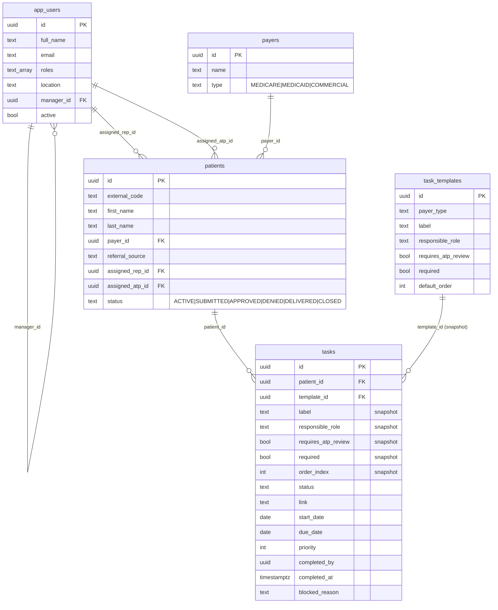

# Architecture — Choice Healthcare Patient Pipeline Tracker (v1)

## 1. Overview

Choice Healthcare is a small medical-equipment provider whose staff currently track each patient's prior-authorization pipeline in scattered spreadsheets and group chats. The tracker is an internal web app that gives every Rep, ATP, Manager, and the owner ("Boss") a single live view of where each patient is in the workflow, what task is next, who owns it, and which approvals are still outstanding. v1 is a thin-but-correct slice: auth, an RLS-protected data model, snapshotted per-patient task lists, and an ATP approval gate. It is not a document store, EHR, or e-sign tool.

## 2. Stack

- **Frontend**: Next.js 16.2 App Router, React 19.2, Tailwind 4 (via `@tailwindcss/postcss`).
- **Backend**: Supabase — Postgres 17, Auth (Microsoft/Azure OAuth + email/password for dev), Row-Level Security.
- **Client libraries**: `@supabase/ssr` for cookie-based server/middleware/browser clients (`src/lib/supabase/{server,browser}.ts`).
- **Hosting**: Vercel (planned — not yet deployed).
- **Local Supabase config**: `supabase/config.toml` declares the Azure external provider and email auth on ports 54321/54322/54323.

## 3. Data model



In v1 a **patient row represents one active pursuit** — patient and "case" are merged so we don't pay the cost of a separate cases table for a workflow that almost always has exactly one in-flight pursuit at a time.

**Tasks are snapshotted from templates.** When a patient is created the matching `task_templates` rows for that payer type are copied into `tasks` (label, responsible_role, requires_atp_review, required, order_index are all denormalized). The `template_id` is kept as a soft pointer (`on delete set null`) but is not authoritative. This means a Manager can edit the master checklist later without rewriting history on patients already mid-flow.

Allowed enum values are enforced with `check` constraints rather than Postgres `ENUM` types — easier to edit in a migration.

## 4. Auth flow

1. User hits any protected path. `src/proxy.ts` checks for a Supabase session cookie via `supabase.auth.getUser()` and, if absent, 302s to `/login?next=<path>`.
2. `/login` renders providers from `enabledProviders()` (`src/lib/auth-providers.ts`). The default primary is Microsoft/Azure; Google is wired but disabled by default; email+password is enabled for local dev seed users.
3. For OAuth, `LoginForm.tsx` calls `supabase.auth.signInWithOAuth({ provider: "azure", options: { redirectTo: "/auth/callback?next=…" } })`.
4. Provider redirects back to `/auth/callback` (`src/app/auth/callback/route.ts`), which calls `supabase.auth.exchangeCodeForSession(code)` to write the session cookie, then redirects to `next`.
5. On first sign-in, Postgres trigger `on_auth_user_created` fires `public.handle_new_auth_user()`, which inserts an `app_users` row defaulted to `roles=['REP'], active=false`. An admin later flips `active=true` and assigns real roles.
6. `requireUser()` (`src/lib/server-helpers.ts`) is the canonical server-side entry: fetches `auth.users` + the `app_users` profile row, or redirects.

```text
Browser  ──signInWithOAuth──▶  Microsoft/Azure
   ▲                                │
   │                                ▼
   └─/auth/callback?code=─── Supabase Auth ──insert auth.users──▶ trigger ──▶ app_users row
```

Providers are **config-driven**: enabling Google or email magic-link later is a `NEXT_PUBLIC_AUTH_*_ENABLED` flag flip plus, for OAuth, a Supabase dashboard toggle — no UI rewrite.

## 5. RLS / visibility model

Four roles live in `app_users.roles text[]`: `REP`, `ATP`, `MANAGER`, `BOSS`. A user can hold multiple (e.g. Matt is `{MANAGER, ATP}` in seed data). Most permissive matching policy wins.

Policies call three **security-definer helper functions** so RLS never has to read `app_users` from inside a policy (which would recurse on the table being protected):

- `current_user_roles()` → `text[]` for `auth.uid()`.
- `has_any_role(needed text[])` → bool.
- `reports_to_me(victim_id uuid)` → bool, true iff `victim.manager_id = auth.uid()`.

Visibility in plain English:

| Table | Read | Write |
|---|---|---|
| `app_users` | everyone authenticated (needed for assignee dropdowns) | self-update, or BOSS/MANAGER on anyone |
| `payers` | everyone authenticated | BOSS only |
| `task_templates` | everyone authenticated | BOSS or MANAGER |
| `patients` | BOSS, or you are assigned rep/atp, or you are MANAGER and the assigned rep/atp reports to you | same as read, plus the `with check` requires you remain the rep/atp (or be BOSS/MANAGER) |
| `tasks` | inherits patient visibility via `exists (select 1 from patients …)` | inherits patient writability |

The `with check` clauses are intentionally slightly stricter than `using` so a Rep can't reassign a patient off themselves.

## 6. The ATP approval gate

RLS controls *which rows* you can touch, not *which column values* you can write. The business rule "only the assigned ATP may flip a task with `requires_atp_review=true` to `status='APPROVED'`" is therefore enforced by a `BEFORE UPDATE` trigger, `public.enforce_task_approval_gate()` (migration `0003_approve_gate.sql`).

Logic (only runs when the new status is `APPROVED` *and* `requires_atp_review=true` *and* status actually changed):

1. **BOSS** → allowed.
2. **Solo case carve-out** — if `assigned_rep_id == assigned_atp_id == auth.uid()`, allowed. (For small teams where one person legitimately wears both hats on a patient.)
3. **Normal gate** — `assigned_atp_id == auth.uid()` AND the user holds the `ATP` role.
4. Otherwise → `raise exception … errcode='42501'`.

The same trigger stamps `completed_at = now()` and `completed_by = auth.uid()` whenever a task enters `APPROVED` or `DONE_PENDING_REVIEW`.

## 7. Core algorithms

Both are implemented in `src/lib/queries.ts` (`computeNextStep` and `fetchDashboardTasks`).

**(a) Next-step for a patient.** Among that patient's tasks where `required = true AND status != 'APPROVED'`, pick the row with the lowest `order_index`. If none → the pipeline is complete. Non-required tasks never block "what's next".

**(b) Dashboard priority sort.** Within a user's visible task list, order by:

1. `priority ASC NULLS LAST` (lower number = bigger bump; null = no manual bump)
2. `due_date ASC NULLS LAST` (sooner is hotter; null floats down)
3. `order_index ASC` (preserve workflow sequence as the tiebreaker)

`isOverdue()` in `src/lib/format.ts` already encodes the "due_date < today" badge logic.

## 8. Directory layout

```text
src/
  proxy.ts                      # session cookie refresh + auth gate (Next 16 proxy convention)
  app/
    layout.tsx                  # root <html>, fonts, globals.css
    login/
      page.tsx                  # server component, reads enabled providers
      LoginForm.tsx             # client: OAuth buttons + dev password form
    auth/
      callback/route.ts         # exchangeCodeForSession
      signout/route.ts          # POST → supabase.auth.signOut → /login
    (app)/
      layout.tsx                # authenticated chrome: nav, role badge, sign-out
      page.tsx                  # dashboard (priority queue across visible patients)
      actions.ts                # server actions: tasks, createPatient, updateUser
      TaskActions.tsx           # client: inline status / priority / link / due-date editor
      patients/
        page.tsx                # patient list
        new/page.tsx            # new-patient form (instantiates tasks from template)
        [id]/page.tsx           # patient detail (full checklist + next-step)
      admin/
        page.tsx                # user activation + role assignment + templates (read-only)
        AdminUserRow.tsx        # client: per-user editor
  lib/
    auth-providers.ts           # config-driven provider list
    db-types.ts                 # hand-written row types
    format.ts                   # status labels, isOverdue, formatDate
    queries.ts                  # fetchDashboardTasks, fetchPatientWithTasks, computeNextStep
    server-helpers.ts           # requireUser, hasRole, isAdmin
    supabase/
      server.ts                 # createServerClient with cookie store
      browser.ts                # singleton createBrowserClient

supabase/
  config.toml                   # local-dev Supabase (Azure provider declared)
  migrations/
    0001_init.sql               # tables, indexes, handle_new_auth_user trigger
    0002_rls.sql                # helpers + policies on all 5 tables
    0003_approve_gate.sql       # enforce_task_approval_gate trigger
  seed.sql                      # 5 auth users + roles + payers + templates + 6 patients
```

## 9. Out of scope for v1

The spec explicitly defers anything that would require a Business Associate Agreement on the Supabase tier or that adds vendor complexity without changing the core workflow:

- **No document storage / file uploads.** Tasks have a `link` text column for an external URL (Drive, EHR) but no Supabase Storage buckets.
- **No notifications.** No email, SMS, Slack, or in-app push.
- **No inventory / equipment catalog.** Tracking ends at "submission to payer / delivered".
- **No e-signature.** Signatures live on the source documents linked to.
- **No audit log table.** `completed_by` + `completed_at` on tasks is the only history v1 carries.

The driving reason cited in the spec is **BAA cost avoidance** while the system is validated — running on Supabase's free tier means no PHI in the database, hence no document blobs and no PHI-bearing notifications.

## 10. Going to production

v1 dev is on the Supabase free tier with synthetic seed data. The path to real-patient production:

1. Upgrade the Supabase project to a paid tier that supports a **Business Associate Agreement** (Team plan with HIPAA add-on, currently).
2. Execute the BAA with Supabase before any real PHI is loaded.
3. Provision a separate production project; run the same `supabase/migrations/*.sql` against it. Skip `seed.sql` in prod.
4. Configure the Azure AD app registration for the production Outlook tenant and set `SUPABASE_AUTH_EXTERNAL_AZURE_{CLIENT_ID,SECRET}` on the Supabase prod project.
5. Deploy the Next.js app to Vercel with `NEXT_PUBLIC_SUPABASE_URL` + `NEXT_PUBLIC_SUPABASE_ANON_KEY` pointing at prod, and `NEXT_PUBLIC_AUTH_EMAIL_ENABLED=false` so the dev password form disappears.
6. Disable email signup in Supabase auth (`enable_signup = false`) once the staff roster is loaded — new accounts should only come via Azure SSO from that point on.
